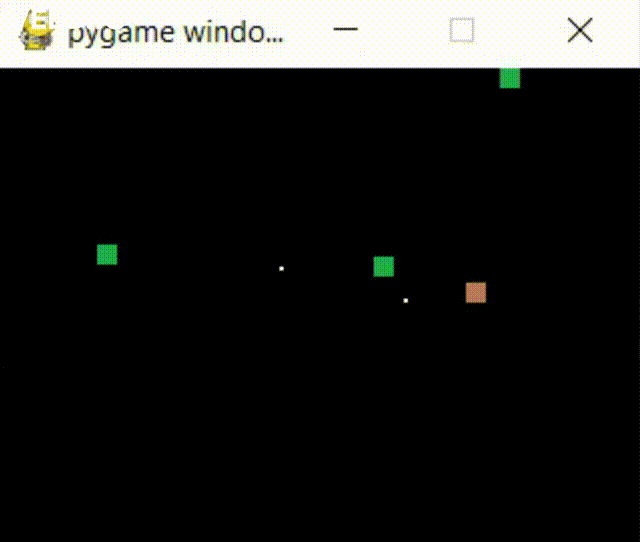

# Diego's Game

## About the Game

### Our Goal

When tasked with creating an interactive program, we jumped on the idea of it being a game. Now, with the current knowledge and resources we decided that a simple top down shooter type game would be a fun challenge for us to take on. Our goal was to create a controllable character that could fire projectiles at targets that spawn around the map. In the end, we were able to reach our goal and even add a few features we came up with along the way.

### Unique Features

Our game has various parts that stand out. Some of those include the controlled character having inertia, making movement less choppy and more realistic. Additionally, we have several different enemies that move at different speeds and take anywhere from one to three hits to be defeated. One more interesting thing is the increasing difficulty as the player defeats each enemy, making the game much more challenging as time goes on.

### Game Demo

## Setup

### To Run in Terminal

Install pygame

`python3 -m pip install -U pygame --user`

See if it has succesfully installed by running the included example:

`python3 -m pygame.examples.aliens`

See Links section below to download the game

## Links

[GitHub Repo Link](https://github.com/olincollege/diegos-game)

[Project Download Link](https://github.com/olincollege/diegos-game/archive/refs/heads/main.zip)

## External Resources

We used [Pygame](https://www.pygame.org/news) to aid us in creating our game.

# About the Creators

## Milo Song-Weiss

He procrastinates a lot.

## Diego Riverbay

He also procrastinates a lot.
